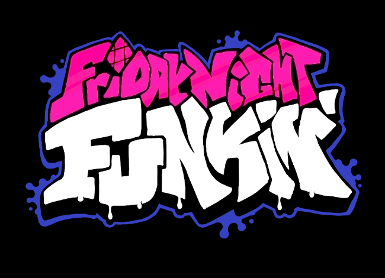

# Friday Night Funkin' &middot;   

Friday Night Funkin' is a rhythm game that doubles as a playable cartoon. Built using HaxeFlixel for Ludem Dare 47.

This game was made with love to Newgrounds and it's community. Extra love to Tom Fulp.

## [Play for free on Newgrounds!](https://www.newgrounds.com/portal/view/770371)
## [Download builds for Windows, Mac, and Linux from Itch.io!](https://ninja-muffin24.itch.io/funkin)

# Getting Started

**PLEASE USE THE LINKS ABOVE IF YOU JUST WANT TO PLAY THE GAME**

To learn how to install the necessary dependencies and compile the game from source, please check out our [building the game]() guide.

# Contributing

Please check out our [Contributor's guide](./CONTRIBUTORS.md) on how you can actively participate in the development of Friday Night Funkin'.

# Credits and Special Thanks

## Programming
- [ninjamuffin99](https://twitter.com/ninja_muffin99) - Lead Programmer
- [MasterEric](https://twitter.com/EliteMasterEric) - Programmer
- [MtH](https://twitter.com/emmnyaa) - Charting and Additional Programming
- [GeoKureli](https://twitter.com/Geokureli/) - Additional Programming
- Our contributors on GitHub

## Art / Animation / UI
- [PhantomArcade3K](https://twitter.com/phantomarcade3k) - Artist and Animator
- [Evilsk8r](https://twitter.com/evilsk8r) - Art
- [Moawling](https://twitter.com/moawko) - Week 6 Pixel Art
- [IvanAlmighty](https://twitter.com/IvanA1mighty) - Misc UI Design

## Music
- [Kawaisprite](https://twitter.com/kawaisprite) - Musician
- [BassetFilms](https://twitter.com/Bassetfilms) - Music for "Monster", Additional Character Design

## Special Thanks
- [Tom Fulp](https://twitter.com/tomfulp) - For being a great guy and for Newgrounds
- [JohnnyUtah](https://twitter.com/JohnnyUtahNG/) - Voice of Tankman
- [L0Litsmonica](https://twitter.com/L0Litsmonica) - Voice of Mommy Mearest
