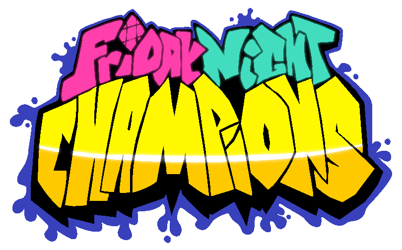

This is the repository for Leather Engine, an engine created for making and playing mods for Friday Night Funkin'.

## Links

- [Gamebanana Page](https://gamebanana.com/mods/334945)

- [Some Mod Ports](https://github.com/Leather128/LeathersFNFModPorts)

## Build Instructions 

### IMPORTANT:

IF YOU GET ANY ERRORS THAT SEEM TO RELATE TO `POLYMOD` (or `NULL OBJECT REFERENCE` / `VALUE EXCEPTION`) RUN `haxelib install polymod 1.3.0` OR `haxelib set polymod 1.3.0` TO SET POLYMOD TO 1.3.0 BECAUSE 1.4.0+ SEEMS BROKEN AS OF NOW.

For build instructions go to [Build.md](https://github.com/Leather128/LeatherEngine/blob/main/Build.md)

## Features

> 1-INF Key Support

What does this mean? Well, now if you want, you can choose a different amount of arrows / keys! (Aka different from 4), this feature goes up to infinity because you can add your own sets of keys, but the default limit is 18 (also yes 1 key is a thing lol).

> Full mod support with Polymod (with a mod loader)!

Support for custom songs, characters, stages, weeks, cutscenes (dialogue, and video), all without modifying the source code! All you have to do is follow a guide that I will be making in the future and then you can make as many mods as you want!

> Custom Cutscenes

Dialogue and video cutscenes can now be used without coding them in! (Although, in the future you will have the option to manually code them)

> Custom Note Types

You can have different note types that give different amounts of health or give damage on hit. They can be more advanced if you want however, since modcharts can access what note type the last note hit was.

> Replay System

You can load, share, and play replays of songs you've played! They can even be included in mods in the mods folder to make them easier to share!

> More to come...

## Credits

* KadeDev - Code for downscroll & Modcharts

* SrPerez - Original 9 Key and 6 Key Designs

* larsiusprime - Scrollable Drop Down Menu

* PolybiusProxy - .mp4 Video Loader Extension

* datee - Developing HaxeVLC (all the contents in the 'vlc' folder belongs to datee).

* Video LAN Team - People who made VLC Media Player (the thing the game uses to play videos)

* Ronezkj15 - Some Ideas + New Leather Engine Logo

* ShadowMario - Color Swap Shader (for notes and stuffs) + some really weird modchart stuff that im too stupid to know lol

* Smokey555 - Adobe Animate Spritemap -> FlxFramesCollection Support